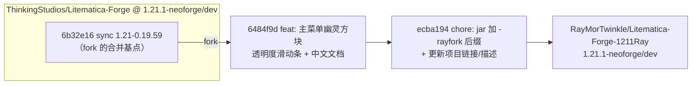

<div align="center">

> [English](./README_en.md) | **简体中文**


# Forgematica · Litematica-Forge-1211Ray

**在原生 NeoForge 上加载、渲染并粘贴 Litematica 蓝图 —— 一个可显示、可校验、可自动建造的 3D 投影脚手架**

把别人建好的建筑"投影"进你的世界，照着幽灵方块一格一格搭出来。


</div>

---

## 它解决什么问题

在 Minecraft 里复刻一座建筑，最大的痛点从来不是"动手"，而是**没有参照**：你只能对着截图估位置、数格子，一层错、层层错。

Litematica 把 `.litematic` 蓝图渲染成漂浮在空中的**半透明幽灵方块**，与原世界一一对齐。你可以：

- 看到每个方块该放哪、用什么方块，颜色/材质一目了然；
- 用选区工具框出一片区域，一键**复制 / 移动 / 填充 / 删除 / 重建**；
- 让模组**校验**你已建成的部分与蓝图是否一致，把差异高亮出来；
- 甚至用任务系统**自动逐区块粘贴**（创造模式）。

而 **Forgematica** 要解决的，是让这套体验能跑在 **NeoForge** 上：原版 Litematica 依赖 LiteLoader/Fabric，Forge 系玩家此前只能用移植质量参差的第三方版本。

> 本仓库是 **RayMor 的个人 fork**（分支 `1.21.1-neoforge/dev`）。它在官方移植版基础上补了一处顺手的小改动：**在主菜单直接放一条幽灵方块透明度滑动条**。差异详见 [🔀 vs 上游](#-vs-上游)。

---

## ✨ 功能

- 🔷 **蓝图渲染**：`Solid / CutoutMipped / Cutout / Translucent` 全部方块层 + Overlay 描边，支持**按相机距离深度排序**的半透明渲染
- 👻 **幽灵方块模式**：把整个蓝图以可调透明度（`ghostBlockAlpha`，默认 `0.5`）叠在世界上；主菜单滑动条可实时调节
- 🧱 **九种工具模式**：`AREA_SELECTION`、`SCHEMATIC_PLACEMENT`、`FILL`、`REPLACE_BLOCK`、`PASTE_SCHEMATIC`、`GRID_PASTE`、`MOVE`、`DELETE`、`REBUILD`
- 📐 **蓝图格式兼容**：原生 `.litematic` 容器（v6/v7），并可导入/导出 `.schematic` 等格式（含降级转换）
- ✅ **蓝图校验器**：把已建区域与蓝图逐方块比对，输出差异清单并高亮
- ⏱️ **任务调度器**：填充/粘贴/删除/计数等操作切成可暂停、可显示进度的后台任务
- 🌐 **服务器辅助同步**：通过 `servux:litematics` 通道从服务端拉取方块实体等数据（需服务端装 Servux 类插件）
- 🎨 **数据驱动 GUI + 完整热键系统**：34KB 的 `Configs` 定义自动生成全部配置控件，38+ 热键覆盖常用操作
- 🧩 **软兼容**：Iris 着色器检测（反射探测，缺失时静默降级）、Mod Menu 配置入口

---

## 🚀 快速开始

### 方式一：面向 AI Agent（一键安装，推荐）

把下面这段提示词直接发给你的本地 AI Agent（Claude Code / Codex / OpenCode …）：

````markdown
请帮我把 Forgematica（GitHub: https://github.com/RayMorTwinkle/Litematica-Forge-1211Ray，
原始上游: https://github.com/ThinkingStudios/Litematica-Forge）编译成 Minecraft 1.21.1 + NeoForge 的模组 jar。

背景：这是 Litematica 的非官方 NeoForge 移植版。它在包名 fi.dy.masa.litematica 下保留原版核心，
并用 org.thinkingstudio.forgematica.Forgematica 作为 NeoForge @Mod 入口；依赖 mafglib 0.3.6。

步骤：
1. 克隆：git clone https://github.com/RayMorTwinkle/Litematica-Forge-1211Ray.git
   并切到分支 1.21.1-neoforge/dev。
2. 若在 Linux/Windows：直接执行 ./gradlew build。
   若在 Apple Silicon macOS：原生构建会因 LWJGL natives-macos-patch 缺失而失败，
   请改用 Docker（eclipse-temurin:21-jdk，见仓库 README 的 macOS 一节）。
3. 产物位于 build/libs/Forgematica-rayfork-mc1.21.1.jar。
4. 把它放进 .minecraft/mods/，并确保已安装同版本的 mafglib。
5. 告诉我构建是否成功，以及产物路径。
````

### 方式二：面向人类用户

```bash
git clone https://github.com/RayMorTwinkle/Litematica-Forge-1211Ray.git
cd Litematica-Forge-1211Ray
git checkout 1.21.1-neoforge/dev
./gradlew build          # 产物：build/libs/Forgematica-rayfork-mc1.21.1.jar
```

macOS（Apple Silicon / ARM64）原生构建会因 remap 阶段找不到 `natives-macos-patch` 而失败，改用 Docker：

```bash
mkdir -p .gradle-docker/{caches,wrapper}
docker run --rm \
  -v "$(pwd):/workspace" \
  -v "$(pwd)/.gradle-docker/caches:/root/.gradle/caches" \
  -v "$(pwd)/.gradle-docker/wrapper:/root/.gradle/wrapper" \
  -w /workspace \
  eclipse-temurin:21-jdk \
  bash -c "chmod +x gradlew && ./gradlew build --no-daemon"
```

> **环境要求**：Minecraft **1.21.1** + NeoForge **21.1.191**，运行时需另装 **[mafglib](https://modrinth.com/mod/mafglib) 0.3.6-mc1.21.1**（`mafglib` 是 malilib 的 NeoForge 移植版）。
> 构建侧需 JDK 21；CI 使用 Gradle Wrapper 8.11.1 + Architectury Loom 1.10。

作为依赖接入：

```gradle
repositories { maven { url 'https://api.modrinth.com/maven' } }
dependencies { modImplementation "maven.modrinth:forgematica:${forgematica_version}" }
```

---

## 🖥️ 使用

### 打开界面

- 默认热键打开主菜单（`OPEN_GUI_MAIN_MENU`），也可在 **Mod Menu** 中进入 `GuiConfigs` 配置页。
- 主菜单（`GuiMainMenu`）是总入口：蓝图放置列表、已加载蓝图、加载/保存蓝图、选区编辑、管理器、任务管理器，以及**本 fork 新增的幽灵方块透明度滑动条**。

### 配置页（6 个标签页）

| 标签页 | 枚举 | 内容 |
|---|---|---|
| 通用 | `GENERIC` | 渲染总开关、粘贴行为、易放置（easy place）等 |
| 信息覆盖 | `INFO_OVERLAYS` | 校验差异、Hover 信息、状态 HUD |
| 视觉 | `VISUALS` | `ghostBlockAlpha`、`renderBlocksAsTranslucent`、深度排序开关等 |
| 颜色 | `COLORS` | 选区/放置/校验框的颜色 |
| 热键 | `HOTKEYS` | 所有按键绑定 |
| 渲染层 | `RENDER_LAYERS` | 蓝图可渲染的方块层白名单 |

### 典型工作流（创造模式粘贴）

```text
1. 主菜单 → Load Schematics → 选择 .litematic
2. 主菜单 → Schematic Placements → 新建放置，对齐到目标位置
3. 拖动「幽灵方块透明度」滑动条，调到看得清又不刺眼
4. 切换到 PASTE_SCHEMATIC 工具模式 → Execute Operation 执行逐区块粘贴
5. 主菜单 → Task Manager 查看进度 / 暂停
```

---

## 🏗️ 架构

### 系统总览

NeoForge 只负责把模组"拉起来"，真正的装配全在 `InitHandler`：它一次性注册配置、按键、渲染、网络、Tick 与世界加载监听器。

```mermaid
flowchart TB
  NF["NeoForge 加载器"] --> MOD["Forgematica<br/>@Mod&#40;value = PORT_ID, dist = CLIENT&#41;"]
  MOD --> INIT["Litematica.onInitialize&#40;&#41;"]
  INIT --> IH["InitHandler.registerModHandlers&#40;&#41;"]

  IH --> CFG["ConfigManager<br/>Configs / Hotkeys"]
  IH --> INP["InputEventHandler<br/>InputHandler"]
  IH --> REN["RenderHandler<br/>worldLast + gameOverlay"]
  IH --> NET["ServerListener<br/>ServuxLitematicaHandler"]
  IH --> TICK["ClientTickHandler<br/>EntitiesDataStorage"]
  IH --> WORLD["WorldLoadListener"]
  IH --> KEYS["KeyCallbacks · StatusInfoRenderer"]

  subgraph CORE["核心状态 · DataManager"]
    SEL["SelectionManager"]
    PLC["SchematicPlacementManager"]
    PRJ["SchematicProjectsManager"]
    HOL["SchematicHolder"]
  end

  REN --> LR["LitematicaRenderer<br/>WorldRendererSchematic"]
  TICK --> TSK["TaskScheduler<br/>ITask 队列"]
  CFG --> CORE
  INP --> KEYS
  KEYS --> CORE
```



### 蓝图数据流：从文件到画面

一次蓝图加载，本质是把磁盘上的调色板 + 位数组，翻译成"每个区块里该画哪些方块"，再交给 VBO 渲染。

```mermaid
flowchart LR
  F[".litematic 文件"] --> CF["LitematicaSchematic.createFromFile&#40;&#41;"]
  CF --> SC["schema 版本<br/>v6 / v7"]
  CF --> CT["LitematicaBlockStateContainer<br/>+ Palette&#40;Linear / HashMap&#41;<br/>+ LitematicaBitArray"]
  CF --> SCH["SchematicHolder.getOrLoad&#40;&#41;"]
  SCH --> PL["SchematicPlacementManager<br/>addSchematicPlacement&#40;&#41;"]
  PL --> PART["PlacementPart<br/>getPlacementPartsInChunk&#40;&#41;"]
  PART --> CC["ChunkCacheSchematic / ChunkSchematic"]
  CC --> CR["ChunkRendererSchematicVbo<br/>逐区块 VBO"]
  CR --> WRS["WorldRendererSchematic<br/>renderBlockLayer&#40;&#41;"]
```



转换与校验是两条并行支线：`SchematicConverter` 负责跨格式（`.schematic` 等）与 v7→v6 降级；`SchematicVerifier` 负责实际方块与蓝图的差异比对。

```mermaid
flowchart TB
  CT["LitematicaBlockStateContainer"] --> CV["conversion/<br/>SchematicConverter"]
  CV --> EF["SchematicConversionFixers<br/>WallStateFixer · DowngradeConverter"]
  CT --> VF["verifier/SchematicVerifier"]
  VF --> VR["VerifierResultSorter<br/>差异清单"]
  VR --> OVR["OverlayRenderer<br/>renderSchematicVerifierMismatches&#40;&#41;"]
```



### 渲染管线（时序）

蓝图不会另起一条渲染循环，而是**借道原版 `WorldRenderer`**：用 Mixin 在每个方块层渲染完后插一段自己的绘制。

```mermaid
sequenceDiagram
  autonumber
  participant MC as Minecraft 帧循环
  participant MX as MixinWorldRenderer
  participant LR as LitematicaRenderer
  participant WR as WorldRendererSchematic
  participant CR as ChunkRendererSchematicVbo

  MC->>MX: setupTerrain&#40;&#41;
  MX->>LR: piecewisePrepareAndUpdate&#40;frustum&#41;
  LR->>WR: setupTerrain / updateChunks
  MC->>MX: renderLayer&#40;Solid / CutoutMipped / Cutout&#41;
  MX->>LR: piecewiseRenderSolid / CutoutMipped / Cutout
  LR->>WR: renderBlockLayer&#40;layer, matrices, camera, projMatrix&#41;
  MC->>MX: renderLayer&#40;Translucent&#41;
  MX->>LR: piecewiseRenderTranslucent + piecewiseRenderOverlay
  LR->>WR: renderBlockLayer&#40;getTranslucent&#40;&#41;&#41;
  WR->>CR: 反向遍历区块（远 → 近）
  CR-->>WR: 相机移动 &gt; 1 格 → resortTransparency&#40;&#41;
  MC->>MX: render&#40;&#41; · swap&#40;"blockentities"&#41;
  MX->>LR: piecewiseRenderEntities&#40;&#41;
```

### 幽灵方块 / 半透明滑动条

这是本 fork 唯一改动的运行时逻辑：主菜单的滑动条直接写 `GHOST_BLOCK_ALPHA`，而渲染层通过全局 shader alpha + 深度重排实现半透明。

```mermaid
flowchart TB
  SL["GuiMainMenu<br/>WidgetSlider"] --> CB["SliderCallbackDouble<br/>setValueRelative&#40;&#41;"]
  CB --> GA["Configs.Visuals.GHOST_BLOCK_ALPHA<br/>ghostBlockAlpha · 默认 0.5 · 范围 0–1"]
  GA --> RB["WorldRendererSchematic.renderBlockLayer&#40;&#41;"]
  RB --> TP{"renderBlocksAsTranslucent?"}
  TP -->|true| RT["所有方块路由到<br/>RenderLayer.getTranslucent&#40;&#41;"]
  RT --> SA["RenderSystem.setShaderColor&#40;1,1,1,alpha&#41;"]
  SA --> RS{"renderEnableTranslucentResorting?"}
  RS -->|true| VS["VertexSorter.byDistance&#40;&#41;<br/>按相机距离重排顶点索引"]
  TP -->|false| DL["按方块材质属性<br/>分配到对应 RenderLayer"]
```



### 任务调度

长耗时的建造/复制操作被切成 `ITask`，由 `TaskScheduler` 按 tick 推进，可随时中断——这是 MOVE/FILL/PASTE 不卡死客户端的关键。

```mermaid
flowchart LR
  EX["Execute Operation<br/>热键回调"] --> TS["TaskScheduler.scheduleTask&#40;task, interval&#41;"]
  TS --> RUN["ClientTickHandler<br/>每 tick → runTasks&#40;&#41;"]
  RUN --> T1["TaskPasteSchematicPerChunk&#42;"]
  RUN --> T2["TaskFillArea / TaskDeleteArea"]
  RUN --> T3["TaskCountBlocksPlacement"]
  RUN --> T4["TaskSaveSchematic / TaskDelay"]
  T1 --> DONE["完成后移除任务<br/>→ 刷新渲染"]
```



---

## 📂 目录结构

```text
Litematica-Forge-1211Ray/
├── src/main/java/
│   ├── org/thinkingstudio/forgematica/
│   │   └── Forgematica.java          # NeoForge @Mod 入口（Dist.CLIENT）
│   └── fi/dy/masa/litematica/        # 原版 Litematica 包名（保持兼容）
│       ├── Litematica.java · InitHandler.java · Reference.java
│       ├── config/                   # Configs（34KB）+ Hotkeys（16KB）
│       ├── data/                     # DataManager · SchematicHolder · EntitiesDataStorage
│       ├── gui/                      # 主菜单 + 24 个界面 + widgets/ 列表控件
│       ├── render/                   # LitematicaRenderer · schematic/ VBO 管线 · infohud/
│       ├── schematic/                # container 容器/调色板 · conversion 转换 · placement 放置 · verifier 校验 · projects
│       ├── selection/                # 选区模型与管理
│       ├── scheduler/                # TaskScheduler + tasks/ 各类任务
│       ├── tool/                     # ToolMode（9 种）
│       ├── network/                  # servux:litematics 通道
│       ├── compat/                   # IrisCompat · ModMenuImpl
│       ├── mixin/                    # 35 条 Mixin 注入（render/block/world/…）
│       └── world/                    # WorldSchematic · ChunkManagerSchematic
├── src/main/resources/
│   ├── META-INF/neoforge.mods.toml   # 模组元数据（displayURL 指向本 fork）
│   ├── mixins.litematica.json        # Mixin 配置（35 条）
│   └── assets/{litematica,forgematica}/lang/   # 11 种语言
├── docs/                             # ★ 本 fork 新增中文分析文档
│   ├── GUI系统结构分析.md
│   ├── 半透明渲染实现分析.md
│   └── plan/半透明滑动条方案.md
├── AGENTS.md                         # ★ 本 fork 新增的 AI 导航指南
├── build.gradle · gradle/libs.versions.toml
└── icon/400x400.png
```

---

## 🔧 技术细节

- **双标识**：对外 `PORT_ID = "forgematica"`（文件/日志），对内 `MOD_ID = "litematica"`（与原版 Configs 持久化键兼容）。`Reference.MOD_STRING` 形如 `litematica-neoforge-1.21.1-…`。
- **模组元数据**：`neoforge.mods.toml` 声明 `modId = "forgematica"`，硬依赖 `neoforge [21,)`、`minecraft [1.21,)`、`mafglib [0.2.6,)`。
- **入口点**：`Forgematica` 构造器仅做两件事——注册 `ConfigScreenEntrypoint → ModMenuImpl`，然后调用 `Litematica.onInitialize()`（后者把 `InitHandler` 交给 mafglib 的 `InitializationHandler`，延迟到客户端就绪时执行）。
- **渲染注入点**（`MixinWorldRenderer`，`@Mixin(WorldRenderer.class)`）：
  - `reload()V` @RETURN → 重新加载蓝图渲染器；
  - `setupTerrain` @TAIL → `piecewisePrepareAndUpdate(frustum)`；
  - `renderLayer` @TAIL → 按层分派 `piecewiseRenderSolid / CutoutMipped / Cutout / Translucent / Overlay`；
  - `render` 中 `swap("blockentities")` 处 → `piecewiseRenderEntities()`。
- **半透明三件套**：`GHOST_BLOCK_ALPHA`(0.5，范围 [0,1])、`RENDER_BLOCKS_AS_TRANSLUCENT`(false)、`RENDER_ENABLE_TRANSLUCENT_RESORTING`(true)、`RENDER_TRANSLUCENT_INNER_SIDES`(false)。开启后所有方块强制路由到 `RenderLayer.getTranslucent()`，用 `RenderSystem.setShaderColor(1,1,1,alpha)` 统一控制透明度，半透明层**反向遍历区块（远→近）**，并在相机移动超过 1 格时调用 `resortTransparency()` → `VertexSorter.byDistance()` 重排顶点索引缓冲。
- **配置键前缀**（持久化到 `forgematica.json`）：`litematica.config.generic` / `info_overlays` / `visuals` / `colors` / `hotkeys` / `lists`。
- **主菜单滑动条（本 fork）**：`SliderCallbackDouble(GHOST_BLOCK_ALPHA, null)` + `WidgetSlider`，拖拽即写 `ConfigDouble`，mafglib 自动持久化，语言键 `litematica.gui.label.ghost_block_alpha`。
- **GUI 数据驱动**：`Configs.Xxx.OPTIONS`（`ImmutableList<IConfigBase>`）→ `ConfigOptionWrapper.createFor()` → mafglib `GuiConfigsBase` 按类型自动生成复选框/整数框/滑动条/下拉/颜色/热键控件。新增一个配置项 = 声明字段 + 加进 OPTIONS，**零 GUI 代码**。
- **Iris 软兼容**：`IrisCompat` 用 `Class.forName("net.irisshaders.iris.api.v0.IrisApi")` + `MethodHandle` 反射探测，未安装 Iris 时 `isIrisActive = false` 并静默降级，无硬依赖。
- **网络通道**：`ServuxLitematicaHandler.CHANNEL_ID = Identifier.of("servux", "litematics")`（基于 ForgifiedFabricAPI 的 networking），用于从服务端补充方块实体数据。
- **构建产物**：`build/libs/Forgematica-rayfork-mc1.21.1.jar`（版本号在 `gradle/libs.versions.toml`，`archivesName` 在 `build.gradle` 追加 `-rayfork`）。
- **代码规模**：约 **221 个 Java 文件 / ~54,000 行**，`mixins.litematica.json` 含 **35 条 Mixin**。

---

## ❓ 常见问题

**Q：为什么叫 Forgematica，但模组 ID 是 `forgematica`、内部却是 `litematica`？**
A：对外端口标识用 `forgematica` 以区别于原版；内部保留 `litematica`，是为了让配置文件键、语言键与原版一致，从别处迁移过来不会失效。

**Q：必须另装 mafglib 吗？**
A：是。`neoforge.mods.toml` 把它列为 `required`（`[0.2.6,)`），缺失将无法启动。推荐与本模组同版本线的 `mafglib 0.3.6-mc1.21.1`。

**Q：幽灵方块模式开了却没变透明？**
A：透明滑动条只改 `ghostBlockAlpha`，前提是 **`renderBlocksAsTranslucent` 已开启**；只调滑动条、不开半透明开关是不会生效的。

**Q：为什么我在 Apple Silicon Mac 上 `./gradlew build` 失败？**
A：Minecraft 1.21.1 重映射阶段需要 `natives-macos-patch` classifier 的 LWJGL 本地库，NeoForge Maven 上该架构的 jar 不完整。用仓库 README 里的 Docker 命令在 Linux x86_64 容器中构建即可。

**Q：这个 fork 和官方移植版会分叉越来越远吗？**
A：本 fork 只做加法、不做减法。相对上游 1.21.1 分支仅领先 2 个提交，上游更新时可直接 follow 合并。

---

## ⚠️ 注意事项

- 本模组为 **客户端模组**（`@Mod(dist = Dist.CLIENT)`）；若要用服务端辅助数据，需要服务端侧配合（如 Servux）。
- 粘贴/填充/移动等**建造类操作通常仅限创造模式**（`ToolMode` 的 `creativeOnly` 标记）；生存下的易放置需服务器允许。
- 渲染依赖对原版 `WorldRenderer` 的 Mixin 注入，**与其它深度改渲染管线的模组可能冲突**；Iris 通过反射软探测，但极端 shader 组合仍可能出现视觉异常。
- 本 fork 相对上游的差异极小，问题排查时请先确认是上游本身的行为还是本 fork 的改动。

---

## 📄 License

**LGPLv3**（GNU Lesser General Public License v3）。完整条款见仓库根目录 [`LICENSE`](./LICENSE)。作为 fork，本仓库沿用上游同样的许可证；衍生分发需遵守 LGPLv3 的相关义务。

---

## 🔀 vs 上游

> 上游：**[ThinkingStudios/Litematica-Forge](https://github.com/ThinkingStudios/Litematica-Forge)**
> 对照分支：`1.21.1-neoforge/dev`（本 fork 的基线）

本 fork 相对上游同名分支，**恰好领先 2 个提交、改动 11 个文件（+926 / −26）**，全部是"加法"，未删除任何上游功能：

| 类别 | 改了什么 | 关键文件 |
|---|---|---|
| 🎚️ GUI | 主菜单新增「幽灵方块透明度」滑动条，拖拽即调 `ghostBlockAlpha` | `gui/GuiMainMenu.java` (+12) |
| 🌏 本地化 | 新增语言键 `litematica.gui.label.ghost_block_alpha` | `assets/litematica/lang/{en_us,zh_cn}.json` |
| 🏷️ 打包 | jar 名追加 `-rayfork` 后缀；版本号 `0.3.3 → 1.0.1` | `build.gradle`、`gradle/libs.versions.toml` |
| 🔗 元数据 | `displayURL` 指向本 fork；`description` 标注 fork 身份 | `META-INF/neoforge.mods.toml` |
| 📚 文档 | 新增 `AGENTS.md` 与 3 篇中文分析文档 | `AGENTS.md`、`docs/` |



**为什么 fork 它？** 上游移植版本身已经可用；这个 fork 的唯一目的是把"调透明度要进三层菜单"变成"在主菜单顺手一拖"，顺便把 GUI/渲染/滑动条三块的中文分析沉淀进 `docs/`，方便自用与后来者阅读源码。

> 另注：若按**跨 Minecraft 版本**对照上游的 `1.21.7-neoforge/dev` 分支，则差异为 16 个提交领先 / 26 个落后 / 约 217 个文件——这部分反映的是 1.21.1 与 1.21.7 两个 MC 版本之间的同步差，**并非本 fork 的自用改动**，请勿混淆。

---

## 🙏 致谢 / Credits

- **[maruohon/litematica](https://github.com/maruohon/litematica)** — Litematica 原作者 **masa**，本模组一切核心逻辑的源头（LGPLv3）。
- **[sakura-ryoko/litematica](https://github.com/sakura-ryoko/litematica)** — 多平台（Forge/NeoForge）移植分支，本仓库的许多构建与后续版本同步源自于此。
- **[ThinkingStudios/Litematica-Forge](https://github.com/ThinkingStudios/Litematica-Forge)**（维护者 **TexTrue / ThinkingStudio**）— 本仓库的直接上游，非官方 NeoForge 移植版。
- **[malilib](https://github.com/maruohon/malilib)** / **[mafglib](https://modrinth.com/mod/mafglib)** — masa 的配置与 GUI 框架及其 NeoForge 移植版；本 fork 的滑动条正是直接复用了 `mafglib` 的 `WidgetSlider` / `SliderCallbackDouble`。
- **[ForgifiedFabricAPI](https://github.com/Sinytra/ForgifiedFabricAPI)** — 让 Fabric 网络 API 在 NeoForge 上运行，支撑 `servux:litematics` 通道。
- 本仓库的 `assets/logo.svg`、中英双语 README 与其中架构图，为本 fork 重制。

---

<div align="center">
<sub>Forgematica · 把别人的城堡，一格一格搬进你的世界</sub>
</div>
