<div align="center">

> **English** | [简体中文](./README.md)


# Forgematica · Litematica-Forge-1211Ray

**Load, render and paste Litematica schematics on native NeoForge — a viewable, verifiable, auto-buildable 3D scaffold**

Project someone else's build into your world, then place it block-by-block following the ghost blocks.


</div>

---

## Why it exists

Recreating a build in Minecraft has never really been about the labor — it's about **the lack of a reference**. With only screenshots you guess positions and count blocks; one layer off and everything above it is off too.

Litematica renders a `.litematic` file as **semi-transparent ghost blocks** floating in the air, perfectly aligned with your world. That lets you:

- see exactly which block goes where, and with what material, at a glance;
- box out a region and **copy / move / fill / delete / rebuild** it with one operation;
- have the mod **verify** what you've built against the schematic and highlight mismatches;
- even **paste chunk-by-chunk automatically** (creative mode) via the task system.

**Forgematica** exists so this experience can run on **NeoForge**: the original Litematica depends on LiteLoader/Fabric, leaving Forge-family players with third-party ports of varying quality.

> This repository is **RayMor's personal fork** (branch `1.21.1-neoforge/dev`). On top of the official port it adds one convenient tweak: **a ghost-block transparency slider right on the main menu**. See [🔀 vs Upstream](#-vs-upstream) for the exact difference.

---

## ✨ Features

- 🔷 **Schematic rendering** — all block layers (`Solid / CutoutMipped / Cutout / Translucent`) plus Overlay outlines, with **camera-distance depth sorting** for translucent geometry
- 👻 **Ghost-block mode** — overlay the whole schematic at a tunable opacity (`ghostBlockAlpha`, default `0.5`); the main-menu slider adjusts it live
- 🧱 **Nine tool modes** — `AREA_SELECTION`, `SCHEMATIC_PLACEMENT`, `FILL`, `REPLACE_BLOCK`, `PASTE_SCHEMATIC`, `GRID_PASTE`, `MOVE`, `DELETE`, `REBUILD`
- 📐 **Format compatibility** — native `.litematic` containers (v6/v7) plus import/export of `.schematic` and friends (with downgrade conversion)
- ✅ **Schematic verifier** — compares your built region against the schematic block-by-block and highlights differences
- ⏱️ **Task scheduler** — fill/paste/delete/count operations become pausable background tasks with progress
- 🌐 **Server-assisted sync** — pulls block-entity data over the `servux:litematics` channel (server side needs a Servux-like plugin)
- 🎨 **Data-driven GUI + full hotkeys** — a 34KB `Configs` definition auto-generates every config widget; 38+ hotkeys cover common actions
- 🧩 **Soft compat** — Iris shader detection (reflection probe with silent fallback), Mod Menu config entry

---

## 🚀 Quick Start

### Option 1: For AI Agents (one-shot install, recommended)

Paste this prompt into your local AI agent (Claude Code / Codex / OpenCode …):

````markdown
Please compile Forgematica (GitHub: https://github.com/RayMorTwinkle/Litematica-Forge-1211Ray,
upstream: https://github.com/ThinkingStudios/Litematica-Forge) into a Minecraft 1.21.1 + NeoForge mod jar.

Context: this is an unofficial NeoForge port of Litematica. It keeps the original core under the package
fi.dy.masa.litematica and uses org.thinkingstudio.forgematica.Forgematica as the NeoForge @Mod entry point;
it depends on mafglib 0.3.6.

Steps:
1. Clone https://github.com/RayMorTwinkle/Litematica-Forge-1211Ray.git and check out branch 1.21.1-neoforge/dev.
2. On Linux/Windows: run ./gradlew build.
   On Apple Silicon macOS: a native build fails because the LWJGL natives-macos-patch classifier is missing;
   use the Docker build instead (eclipse-temurin:21-jdk, see the README's macOS section).
3. The artifact is build/libs/Forgematica-rayfork-mc1.21.1.jar.
4. Drop it into .minecraft/mods/ and make sure mafglib of the matching version is installed too.
5. Tell me whether the build succeeded and where the artifact is.
````

### Option 2: For humans

```bash
git clone https://github.com/RayMorTwinkle/Litematica-Forge-1211Ray.git
cd Litematica-Forge-1211Ray
git checkout 1.21.1-neoforge/dev
./gradlew build          # artifact: build/libs/Forgematica-rayfork-mc1.21.1.jar
```

On macOS (Apple Silicon / ARM64) a native build fails during remapping because `natives-macos-patch` is unavailable; use Docker:

```bash
mkdir -p .gradle-docker/{caches,wrapper}
docker run --rm \
  -v "$(pwd):/workspace" \
  -v "$(pwd)/.gradle-docker/caches:/root/.gradle/caches" \
  -v "$(pwd)/.gradle-docker/wrapper:/root/.gradle/wrapper" \
  -w /workspace \
  eclipse-temurin:21-jdk \
  bash -c "chmod +x gradlew && ./gradlew build --no-daemon"
```

> **Requirements**: Minecraft **1.21.1** + NeoForge **21.1.191**; at runtime you also need **[mafglib](https://modrinth.com/mod/mafglib) 0.3.6-mc1.21.1** (the NeoForge port of malilib).
> For building: JDK 21; CI uses the Gradle Wrapper 8.11.1 + Architectury Loom 1.10.

As a dependency:

```gradle
repositories { maven { url 'https://api.modrinth.com/maven' } }
dependencies { modImplementation "maven.modrinth:forgematica:${forgematica_version}" }
```

---

## 🖥️ Usage

### Opening the UI

- The main menu opens via a hotkey (`OPEN_GUI_MAIN_MENU`) or through **Mod Menu** → `GuiConfigs`.
- The main menu (`GuiMainMenu`) is the hub: schematic placements, loaded schematics, load/save, area editor, managers, the task manager — and **this fork's new ghost-block transparency slider**.

### Config screen (6 tabs)

| Tab | Enum | Contents |
|---|---|---|
| Generic | `GENERIC` | global rendering toggle, paste behavior, easy place, … |
| Info Overlays | `INFO_OVERLAYS` | verifier mismatches, hover info, status HUD |
| Visuals | `VISUALS` | `ghostBlockAlpha`, `renderBlocksAsTranslucent`, resorting toggles, … |
| Colors | `COLORS` | selection/placement/verifier box colors |
| Hotkeys | `HOTKEYS` | all keybindings |
| Render Layers | `RENDER_LAYERS` | whitelist of renderable block layers |

### Typical workflow (creative paste)

```text
1. Main menu → Load Schematics → pick a .litematic
2. Main menu → Schematic Placements → create a placement, align it to the target
3. Drag the "Ghost Block Alpha" slider to a comfortable opacity
4. Switch to the PASTE_SCHEMATIC tool mode → Execute Operation to paste chunk-by-chunk
5. Main menu → Task Manager to watch progress / pause
```

---

## 🏗️ Architecture

### System overview

NeoForge only "boots" the mod; all the wiring happens in `InitHandler`, which registers config, input, rendering, networking, tick and world-load listeners in one place.

```mermaid
flowchart TB
  NF["NeoForge loader"] --> MOD["Forgematica<br/>@Mod&#40;value = PORT_ID, dist = CLIENT&#41;"]
  MOD --> INIT["Litematica.onInitialize&#40;&#41;"]
  INIT --> IH["InitHandler.registerModHandlers&#40;&#41;"]

  IH --> CFG["ConfigManager<br/>Configs / Hotkeys"]
  IH --> INP["InputEventHandler<br/>InputHandler"]
  IH --> REN["RenderHandler<br/>worldLast + gameOverlay"]
  IH --> NET["ServerListener<br/>ServuxLitematicaHandler"]
  IH --> TICK["ClientTickHandler<br/>EntitiesDataStorage"]
  IH --> WORLD["WorldLoadListener"]
  IH --> KEYS["KeyCallbacks · StatusInfoRenderer"]

  subgraph CORE["Core state · DataManager"]
    SEL["SelectionManager"]
    PLC["SchematicPlacementManager"]
    PRJ["SchematicProjectsManager"]
    HOL["SchematicHolder"]
  end

  REN --> LR["LitematicaRenderer<br/>WorldRendererSchematic"]
  TICK --> TSK["TaskScheduler<br/>ITask queue"]
  CFG --> CORE
  INP --> KEYS
  KEYS --> CORE
```



### Schematic data flow: from file to frame

Loading a schematic is really translating an on-disk palette + bit-array into "which blocks to draw in each chunk", then handing that to the VBO renderer.

```mermaid
flowchart LR
  F[".litematic file"] --> CF["LitematicaSchematic.createFromFile&#40;&#41;"]
  CF --> SC["schema version<br/>v6 / v7"]
  CF --> CT["LitematicaBlockStateContainer<br/>+ Palette&#40;Linear / HashMap&#41;<br/>+ LitematicaBitArray"]
  CF --> SCH["SchematicHolder.getOrLoad&#40;&#41;"]
  SCH --> PL["SchematicPlacementManager<br/>addSchematicPlacement&#40;&#41;"]
  PL --> PART["PlacementPart<br/>getPlacementPartsInChunk&#40;&#41;"]
  PART --> CC["ChunkCacheSchematic / ChunkSchematic"]
  CC --> CR["ChunkRendererSchematicVbo<br/>per-chunk VBO"]
  CR --> WRS["WorldRendererSchematic<br/>renderBlockLayer&#40;&#41;"]
```



Conversion and verification are two parallel branches: `SchematicConverter` handles cross-format (`.schematic`, …) and v7→v6 downgrades; `SchematicVerifier` diffs placed blocks against the schematic.

```mermaid
flowchart TB
  CT["LitematicaBlockStateContainer"] --> CV["conversion/<br/>SchematicConverter"]
  CV --> EF["SchematicConversionFixers<br/>WallStateFixer · DowngradeConverter"]
  CT --> VF["verifier/SchematicVerifier"]
  VF --> VR["VerifierResultSorter<br/>mismatch list"]
  VR --> OVR["OverlayRenderer<br/>renderSchematicVerifierMismatches&#40;&#41;"]
```



### Render pipeline (sequence)

The schematic does **not** start its own render loop — it piggybacks on vanilla's `WorldRenderer`: a Mixin injects a draw pass right after each block layer.

```mermaid
sequenceDiagram
  autonumber
  participant MC as Minecraft frame loop
  participant MX as MixinWorldRenderer
  participant LR as LitematicaRenderer
  participant WR as WorldRendererSchematic
  participant CR as ChunkRendererSchematicVbo

  MC->>MX: setupTerrain&#40;&#41;
  MX->>LR: piecewisePrepareAndUpdate&#40;frustum&#41;
  LR->>WR: setupTerrain / updateChunks
  MC->>MX: renderLayer&#40;Solid / CutoutMipped / Cutout&#41;
  MX->>LR: piecewiseRenderSolid / CutoutMipped / Cutout
  LR->>WR: renderBlockLayer&#40;layer, matrices, camera, projMatrix&#41;
  MC->>MX: renderLayer&#40;Translucent&#41;
  MX->>LR: piecewiseRenderTranslucent + piecewiseRenderOverlay
  LR->>WR: renderBlockLayer&#40;getTranslucent&#40;&#41;&#41;
  WR->>CR: iterate chunks in reverse (far → near)
  CR-->>WR: camera moved &gt; 1 block → resortTransparency&#40;&#41;
  MC->>MX: render&#40;&#41; · swap&#40;"blockentities"&#41;
  MX->>LR: piecewiseRenderEntities&#40;&#41;
```

### Ghost blocks / the transparency slider

This is the fork's only runtime change: the main-menu slider writes `GHOST_BLOCK_ALPHA` directly, while the renderer achieves translucency via global shader alpha plus depth resorting.

```mermaid
flowchart TB
  SL["GuiMainMenu<br/>WidgetSlider"] --> CB["SliderCallbackDouble<br/>setValueRelative&#40;&#41;"]
  CB --> GA["Configs.Visuals.GHOST_BLOCK_ALPHA<br/>ghostBlockAlpha · default 0.5 · range 0–1"]
  GA --> RB["WorldRendererSchematic.renderBlockLayer&#40;&#41;"]
  RB --> TP{"renderBlocksAsTranslucent?"}
  TP -->|true| RT["all blocks routed to<br/>RenderLayer.getTranslucent&#40;&#41;"]
  RT --> SA["RenderSystem.setShaderColor&#40;1,1,1,alpha&#41;"]
  SA --> RS{"renderEnableTranslucentResorting?"}
  RS -->|true| VS["VertexSorter.byDistance&#40;&#41;<br/>re-sort vertex indices by camera distance"]
  TP -->|false| DL["route blocks to their<br/>material-based RenderLayer"]
```



### Task scheduling

Long build/copy operations are sliced into `ITask`s driven tick-by-tick by `TaskScheduler`, and can be interrupted at any time — the key to MOVE/FILL/PASTE not freezing the client.

```mermaid
flowchart LR
  EX["Execute Operation<br/>hotkey callback"] --> TS["TaskScheduler.scheduleTask&#40;task, interval&#41;"]
  TS --> RUN["ClientTickHandler<br/>every tick → runTasks&#40;&#41;"]
  RUN --> T1["TaskPasteSchematicPerChunk&#42;"]
  RUN --> T2["TaskFillArea / TaskDeleteArea"]
  RUN --> T3["TaskCountBlocksPlacement"]
  RUN --> T4["TaskSaveSchematic / TaskDelay"]
  T1 --> DONE["remove on completion<br/>→ refresh renderer"]
```



---

## 📂 Project layout

```text
Litematica-Forge-1211Ray/
├── src/main/java/
│   ├── org/thinkingstudio/forgematica/
│   │   └── Forgematica.java          # NeoForge @Mod entry (Dist.CLIENT)
│   └── fi/dy/masa/litematica/        # original Litematica package (kept for compatibility)
│       ├── Litematica.java · InitHandler.java · Reference.java
│       ├── config/                   # Configs (34KB) + Hotkeys (16KB)
│       ├── data/                     # DataManager · SchematicHolder · EntitiesDataStorage
│       ├── gui/                      # main menu + 24 screens + widgets/ list controls
│       ├── render/                   # LitematicaRenderer · schematic/ VBO pipeline · infohud/
│       ├── schematic/                # container · conversion · placement · verifier · projects
│       ├── selection/                # selection models and management
│       ├── scheduler/                # TaskScheduler + tasks/
│       ├── tool/                     # ToolMode (9 modes)
│       ├── network/                  # servux:litematics channel
│       ├── compat/                   # IrisCompat · ModMenuImpl
│       ├── mixin/                    # 35 Mixin injections (render/block/world/…)
│       └── world/                    # WorldSchematic · ChunkManagerSchematic
├── src/main/resources/
│   ├── META-INF/neoforge.mods.toml   # mod metadata (displayURL points to this fork)
│   ├── mixins.litematica.json        # Mixin config (35 entries)
│   └── assets/{litematica,forgematica}/lang/   # 11 languages
├── docs/                             # ★ Chinese analysis docs added by this fork
│   ├── GUI系统结构分析.md
│   ├── 半透明渲染实现分析.md
│   └── plan/半透明滑动条方案.md
├── AGENTS.md                         # ★ AI navigation guide added by this fork
├── build.gradle · gradle/libs.versions.toml
└── icon/400x400.png
```

---

## 🔧 Technical notes

- **Dual identity**: external `PORT_ID = "forgematica"` (files/logs) vs internal `MOD_ID = "litematica"` (compatible with the original's Configs persistence keys). `Reference.MOD_STRING` looks like `litematica-neoforge-1.21.1-…`.
- **Mod metadata**: `neoforge.mods.toml` declares `modId = "forgematica"` and hard-depends on `neoforge [21,)`, `minecraft [1.21,)`, `mafglib [0.2.6,)`.
- **Entry point**: the `Forgematica` constructor does exactly two things — register `ConfigScreenEntrypoint → ModMenuImpl`, then call `Litematica.onInitialize()` (which hands `InitHandler` to mafglib's `InitializationHandler`, deferred until the client is ready).
- **Render injection points** (`MixinWorldRenderer`, `@Mixin(WorldRenderer.class)`):
  - `reload()V` @RETURN → reload the schematic renderer;
  - `setupTerrain` @TAIL → `piecewisePrepareAndUpdate(frustum)`;
  - `renderLayer` @TAIL → dispatch `piecewiseRenderSolid / CutoutMipped / Cutout / Translucent / Overlay` by layer;
  - at `render`'s `swap("blockentities")` → `piecewiseRenderEntities()`.
- **The translucent trio**: `GHOST_BLOCK_ALPHA` (0.5, range [0,1]), `RENDER_BLOCKS_AS_TRANSLUCENT` (false), `RENDER_ENABLE_TRANSLUCENT_RESORTING` (true), `RENDER_TRANSLUCENT_INNER_SIDES` (false). When enabled, all blocks are forced into `RenderLayer.getTranslucent()`, alpha is controlled globally via `RenderSystem.setShaderColor(1,1,1,alpha)`, the translucent layer iterates chunks **in reverse (far → near)**, and once the camera moves more than 1 block, `resortTransparency()` → `VertexSorter.byDistance()` re-sorts the vertex index buffer.
- **Config key prefixes** (persisted to `forgematica.json`): `litematica.config.generic` / `info_overlays` / `visuals` / `colors` / `hotkeys` / `lists`.
- **Main-menu slider (this fork)**: `SliderCallbackDouble(GHOST_BLOCK_ALPHA, null)` + `WidgetSlider`; dragging writes the `ConfigDouble`, mafglib auto-persists, and the lang key is `litematica.gui.label.ghost_block_alpha`.
- **Data-driven GUI**: `Configs.Xxx.OPTIONS` (`ImmutableList<IConfigBase>`) → `ConfigOptionWrapper.createFor()` → mafglib's `GuiConfigsBase` auto-generates checkbox/int field/slider/dropdown/color/hotkey widgets by type. Adding a config = declare a field + add it to `OPTIONS`, **zero GUI code**.
- **Iris soft compat**: `IrisCompat` probes via `Class.forName("net.irisshaders.iris.api.v0.IrisApi")` + `MethodHandle`; without Iris, `isIrisActive = false` and it silently degrades — no hard dependency.
- **Network channel**: `ServuxLitematicaHandler.CHANNEL_ID = Identifier.of("servux", "litematics")` (built on ForgifiedFabricAPI networking) to supplement block-entity data from the server.
- **Build artifacts**: `build/libs/Forgematica-rayfork-mc1.21.1.jar` (version in `gradle/libs.versions.toml`; `archivesName` appends `-rayfork` in `build.gradle`).
- **Code size**: ~**221 Java files / ~54,000 lines**; `mixins.litematica.json` contains **35 Mixins**.

---

## ❓ FAQ

**Q: Why is it called Forgematica when the mod id is `forgematica` but the internals are `litematica`?**
A: The external port id is `forgematica` to distinguish it from the original; the internal `litematica` is kept so that config keys and lang keys stay identical and migration from other setups keeps working.

**Q: Do I have to install mafglib separately?**
A: Yes. `neoforge.mods.toml` marks it `required` (`[0.2.6,)`); it won't launch without it. The matching line `mafglib 0.3.6-mc1.21.1` is recommended.

**Q: I enabled ghost-block mode but nothing looks translucent.**
A: The slider only changes `ghostBlockAlpha`; it takes effect only if **`renderBlocksAsTranslucent` is on**. Adjusting the slider alone does nothing.

**Q: Why does `./gradlew build` fail on my Apple Silicon Mac?**
A: Remapping Minecraft 1.21.1 needs the LWJGL native library with the `natives-macos-patch` classifier, which is incomplete for that architecture on NeoForge Maven. Use the Docker command in the README to build inside a Linux x86_64 container.

**Q: Will this fork drift far from the official port?**
A: It only adds, never removes. It is just 2 commits ahead of upstream's 1.21.1 branch, so upstream updates can be merged by a straightforward follow.

---

## ⚠️ Notes

- This is a **client-side mod** (`@Mod(dist = Dist.CLIENT)`); server-assisted data requires a cooperating server-side (e.g. Servux).
- Build-type operations (paste/fill/move) are **usually creative-only** (the `creativeOnly` flag on `ToolMode`); survival easy-place requires server permission.
- Rendering relies on Mixin injections into vanilla `WorldRenderer`, so **it may conflict with other mods that deeply alter the render pipeline**; Iris is probed softly, but extreme shader combos can still misbehave.
- The fork's delta from upstream is tiny — when troubleshooting, first check whether the behavior comes from upstream itself or from this fork's change.

---

## 📄 License

**LGPLv3** (GNU Lesser General Public License v3). See [`LICENSE`](./LICENSE) in the repo root. As a fork, this repository keeps the same license as upstream; redistribution must comply with LGPLv3.

---

## 🔀 vs Upstream

> Upstream: **[ThinkingStudios/Litematica-Forge](https://github.com/ThinkingStudios/Litematica-Forge)**
> Compared branch: `1.21.1-neoforge/dev` (this fork's baseline)

Against upstream's same-named branch, this fork is **exactly 2 commits ahead across 11 files (+926 / −26)** — all additions, nothing from upstream removed:

| Area | Change | Key files |
|---|---|---|
| 🎚️ GUI | Main menu gains a "Ghost Block Alpha" slider that adjusts `ghostBlockAlpha` on drag | `gui/GuiMainMenu.java` (+12) |
| 🌏 i18n | New lang key `litematica.gui.label.ghost_block_alpha` | `assets/litematica/lang/{en_us,zh_cn}.json` |
| 🏷️ Packaging | jar name gets a `-rayfork` suffix; version `0.3.3 → 1.0.1` | `build.gradle`, `gradle/libs.versions.toml` |
| 🔗 Metadata | `displayURL` points to this fork; `description` marks fork status | `META-INF/neoforge.mods.toml` |
| 📚 Docs | Adds `AGENTS.md` and 3 Chinese analysis docs | `AGENTS.md`, `docs/` |

```mermaid
flowchart LR
  subgraph UP["ThinkingStudios/Litematica-Forge @ 1.21.1-neoforge/dev"]
    U1["6b32e16 sync 1.21-0.19.59<br/>&#40;the fork's merge base&#41;"]
  end
  U1 -->|fork| F1["6484f9d feat: main-menu ghost-block<br/>transparency slider + Chinese docs"]
  F1 --> F2["ecba194 chore: jar -rayfork suffix<br/>+ update project URL/description"]
  F2 --> HEAD["RayMorTwinkle/Litematica-Forge-1211Ray<br/>1.21.1-neoforge/dev"]
```



**Why fork it?** Upstream's port is already usable; this fork's only goal is to turn "dig three menu levels deep to change opacity" into "drag once on the main menu", and to distill the GUI/render/slider knowledge into `docs/` for personal use and for anyone reading the source.

> Note: compared against upstream's **cross-Minecraft-version** `1.21.7-neoforge/dev` branch, the delta is 16 commits ahead / 26 behind / ~217 files — that reflects the 1.21.1 ↔ 1.21.7 version gap, **not this fork's own changes**. Don't conflate the two.

---

## 🙏 Credits

- **[maruohon/litematica](https://github.com/maruohon/litematica)** — original author **masa**; the source of every core behavior here (LGPLv3).
- **[sakura-ryoko/litematica](https://github.com/sakura-ryoko/litematica)** — the multi-platform (Forge/NeoForge) port branch that many of this repo's build and sync changes trace back to.
- **[ThinkingStudios/Litematica-Forge](https://github.com/ThinkingStudios/Litematica-Forge)** (maintainers **TexTrue / ThinkingStudio**) — this repository's direct upstream, the unofficial NeoForge port.
- **[malilib](https://github.com/maruohon/malilib)** / **[mafglib](https://modrinth.com/mod/mafglib)** — masa's config & GUI framework and its NeoForge port; this fork's slider directly reuses mafglib's `WidgetSlider` / `SliderCallbackDouble`.
- **[ForgifiedFabricAPI](https://github.com/Sinytra/ForgifiedFabricAPI)** — makes Fabric's networking API run on NeoForge, powering the `servux:litematics` channel.
- The `assets/logo.svg`, the bilingual READMEs and their diagrams were remade for this fork.

---

<div align="center">
<sub>Forgematica · carry someone else's castle into your world, one block at a time</sub>
</div>
